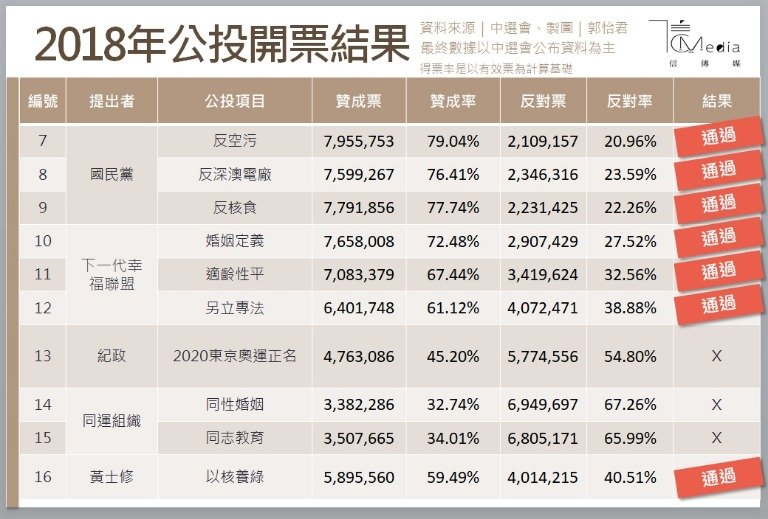
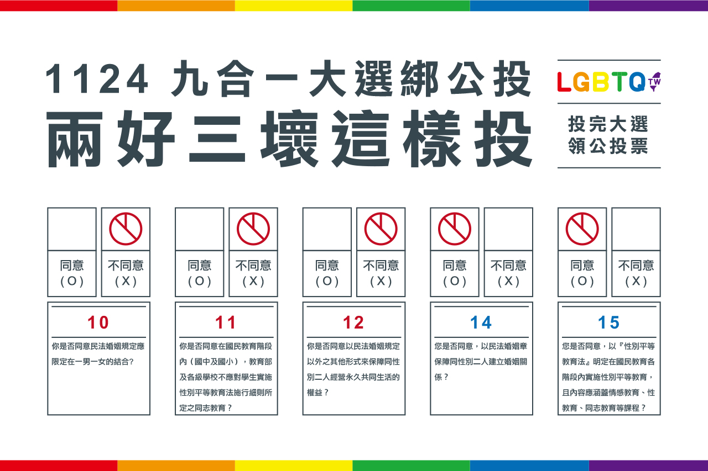
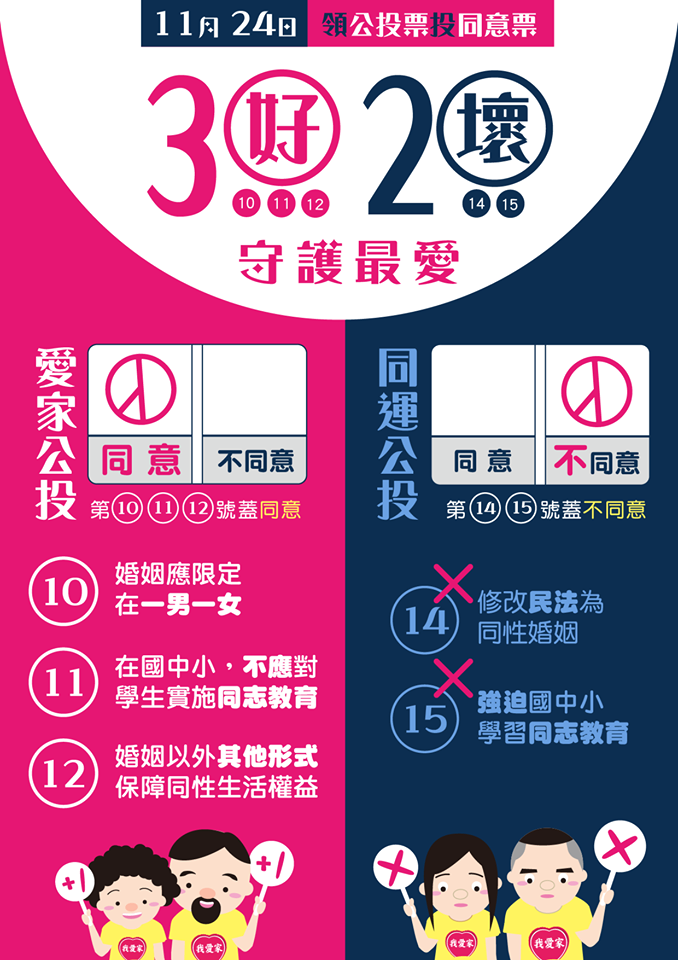
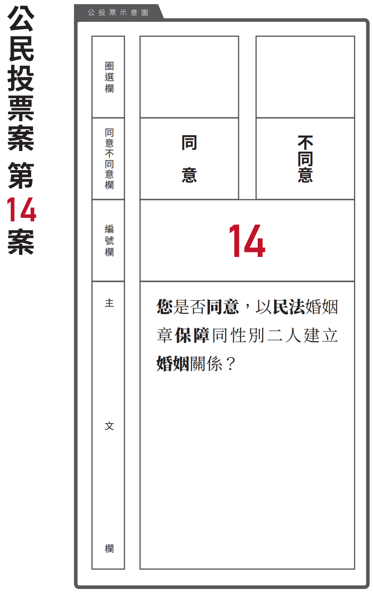

```{r setup, include=FALSE}
options(htmltools.dir.version = FALSE)
knitr::opts_chunk$set(echo = FALSE, warning = FALSE, message = FALSE)
```

# QR-code of this R presentation

```{r, fig.algin="center"}

```

---

# 前言

2018年11月24日中華民國全國性公民投票結果  


---

# 性平公投 vs. 愛家公投 

.pull-left[
```{r, out.width="100%"}

```
]

--

.pull-right[
```{r, out.width="100%"}

```
]

---

# 探討對象

```{r, out.width="60%", fig.align="center"}

```

---

# Outline
- 文獻回顧與研究目的

- 資料來源與前處理

- 迴歸模型

- 總結

---
class: inverse, center, middle

# 文獻回顧

---
class: inverse, center, middle

# 資料來源與前處理

---

# 資料來源
- 公投：
    + [政府資料開放平臺_第14案全國性公民投票計票結果](https://data.gov.tw/dataset/95883)
    
- 人口年齡組成：
    + [內政資料開放平臺_村里戶數、單一年齡人口（新增區域代碼）](https://bit.ly/30DWL5J)
    
- 結婚與教育：
    + [內政資料開放平臺_15歲以上現住人口按性別、年齡、婚姻狀況及教育程度分](https://bit.ly/2QdqGgk)
    
- 薪水中位數：
    + [財政部財政資訊中心_105年度綜合所得稅申報核定統計專冊](https://bit.ly/2M3IiwY)

---

# 公投第 14 案

.pull-left_25[
```{r, comment=NA}
library(dplyr)
library(tidyr)

Data <- readRDS("Data.rds")

print_summary <- function(data){
  .s <- summary(data) %>% t() %>% t() %>% round(digits = 3)
  rownames(.s) <- c("Min.", "Qu_1", "Med.", "Mean", "Qu_3", "Max.")
  write.table(format(.s, justify = "right"), 
              quote =FALSE, col.names = FALSE, sep = "\t")
}

print_summary(Data$agree_rate)
```
]
.pull-right_75[
```{r, out.height="100%", fig.align="right"}
library(ggplot2)
library(plotly)
g <- ggplot(Data, aes(x = agree_rate, fill = location)) +
  geom_histogram() +
  theme_bw()
ggplotly(g) %>% 
  layout(legend = list(orientation = "h", x = 0, y = 1))
```
]

---

# 投票率
.pull-left_25[
```{r, comment=NA}
print_summary(Data$vote_rate)
```
]
.pull-right_75[
```{r, out.height="100%", fig.align="right"}
g <- ggplot(Data, aes(x = vote_rate, fill = location)) +
  geom_histogram() +
  theme_bw()
ggplotly(g) %>% 
  layout(legend = list(orientation = "h", x = 0, y = 1))
```
]
---

# 性別比
.pull-left_25[
```{r, comment=NA}
print_summary(Data$gender_ratio)
```
]
.pull-right_75[
```{r, out.height="100%", fig.align="right"}
g <- ggplot(Data, aes(gender_ratio, fill = location)) +
  geom_histogram() +
  theme_bw()
ggplotly(g) %>% 
  layout(legend = list(orientation = "h", x = 0, y = 1))
```
]
---

# 年齡組成

老人太多較無法接受 & 都是老人去投票？

--

.pull-left_25[
老年人(65~)比例
```{r, comment=NA}
print_summary(Data$old_ratio)
```

年輕人(18~30)比例
```{r, comment=NA}
print_summary(Data$young_ratio)
```
]
.pull-right_75[
```{r, out.height="100%", fig.align="right"}
g <- Data %>% 
  select(old_ratio, young_ratio, location) %>% 
  gather(key = ageGroup, value = ratio, old_ratio, young_ratio) %>% 
  ggplot(aes(x = ratio, fill = location)) +
  geom_histogram() +
  facet_wrap(~ageGroup) +
  theme_bw()
ggplotly(g) %>% 
  layout(legend = list(orientation = "h", x = 0, y = 1))
```
]
.footnote[
*應該改用青年和中年，之前記錯了
]

---

# 結婚狀況

曾今結婚率 = (喪偶＋有偶+離婚) / Total

--

.pull-left_25[
```{r, comment=NA}
print_summary(Data$married_ratio)
```
]
.pull-right_75[
```{r, fig.height=6, fig.align="right"}
g <- ggplot(Data, aes(married_ratio, fill = location)) + 
  geom_histogram() +
  theme_bw()
ggplotly(g) %>% 
  layout(legend = list(orientation = "h", x = 0, y = 1))
```
]

---

# 教育程度

大專畢業的比例 = (大學+大專+碩士+博士) / Total

--

.pull-left_25[
```{r, comment=NA}
print_summary(Data$college_ratio)
```
]
.pull-right_75[
```{r, fig.height=6, fig.align="right"}
g <- ggplot(Data, aes(college_ratio, fill = location)) +
  geom_histogram() +
  theme_bw()
ggplotly(g) %>% 
  layout(legend = list(orientation = "h", x = 0, y = 1))
```
]

---

# 薪水中位數

.pull-left_25[
```{r, comment=NA}
print_summary(Data$salary_med)
```
]
.pull-right_75[
```{r, fig.height = 6, fig.align="right"}
g <- ggplot(Data, aes(salary_med, fill = location)) +
  geom_histogram() +
  theme_bw()
ggplotly(g) %>% 
  layout(legend = list(orientation = "h", x = 0, y = 1))
```
]

---

# 資料地圖

[map](https://xup6y3ul6.github.io/ALSN_final_report/referendum14_map.html#1)

---

# scatter-correlation plot
```{r, fig.align="center", fig.height=7.5, fig.width=10}
data <- Data %>% 
  select(agree_rate, vote_rate, is_municipality, 
         gender_ratio, young_old_ratio, 
         married_ratio, college_ratio, salary_med)
.names <- names(data)
names(data) <- c("Y", paste0("X", 1:(length(.names)-1)))

# for(i in 1:length(.names)){
#   attr(data[[i]], "label") <- .names[i]
# }
# 

## reference: https://github.com/ggobi/ggally/issues/139 
library(GGally)
source("my_custom_GGally.R")
ggpairs(data, 
        upper = list(continuous = my_custom_cor_color),
        lower = list(continuous = my_custom_smooth)) 
```

---
class: inverse, center, middle

# 回歸模型

---

# first ordinal regression

agree_rate = vote_rate + municipality + 
         gender + YO_ratio + married + college + salary
         
--

```{r, comment=NA, highlight.output=c(2,3,4,6,7,8)}
library(car)
model_1st <- lm(Y ~ ., data)
. <- summary(model_1st)
.$coefficients %>% round(digits = 3)
```
```{r, comment=NA}
write.table(paste("Multiple R-squared:", round(.$r.squared, 2), ", ", "Adjusted R-squared:", round(.$adj.r.squared, 2)), 
            quote = FALSE, row.names = FALSE, col.names = FALSE)
```


---

agree_rate = ...

```{r, comment=NA}
Anova(model_1st,type = "II")
```

---

# residul plot

.pull-left[
```{r, fig.align="center", out.width="100%"}
model_1st_data <- data.frame(res = residuals(model_1st),
                             fit = predict(model_1st),
                             y = data$Y)
ggplot(model_1st_data, aes(x = res, y = fit)) +
  geom_point() +
  theme_bw()
#gridExtra::grid.arrange(g1, g2, nrow = 1)
```
]
.pull-right[
```{r, fig.align="center", out.width="100%"}
ggplot(model_1st_data, aes(sample = res)) +
  geom_qq() +
  geom_qq_line(color = "red", line.p = c(0.25, 0.75), linetype = "dashed") + 
  theme_bw()
```
]

---

# check outlier

---

# after removed outlier

```{r, comment=NA, highlight.output=2:9}
data.rm <- data[-4,]
model_1st.rm <- lm(Y ~ ., data.rm)
. <- summary(model_1st.rm)
.$coefficients %>% round(digits = 3)
```
```{r}
write.table(paste("Multiple R-squared:", round(.$r.squared, 2), ", ", "Adjusted R-squared:", round(.$adj.r.squared, 2)), 
            quote = FALSE, row.names = FALSE, col.names = FALSE)
```

---

# find better models

```{r, comment=NA}
library(leaps)
best <- function(model, nbest = 1, nvmax = 8, ...) {
  subsets <- regsubsets(formula(model), model.frame(model), nbest = nbest, nvmax = nvmax, ...)
  subsets <- with(summary(subsets),
                  cbind(p = as.numeric(rownames(which)), which, rss,
                        rsq, adjr2, cp, bic))
    
  return(subsets)
}  

. <- round(best(lm(Y ~. + .:., data.rm), nbest = 2, nvmax = 10), 4)
knitr::kable(., format = 'html')
```

---
class: inverse, center, middle

# 總結

---