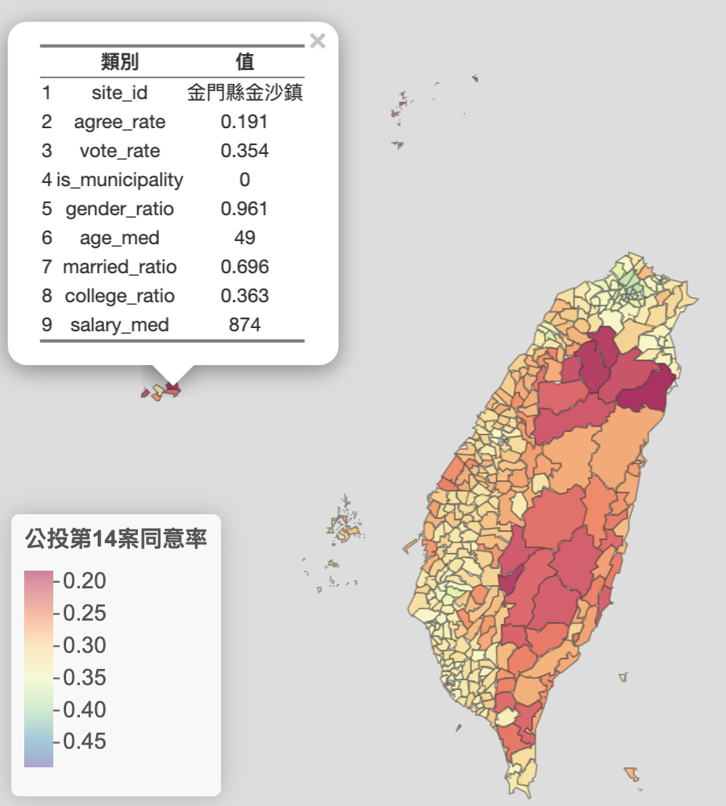

```{r setup, include=FALSE}
options(htmltools.dir.version = FALSE)
knitr::opts_chunk$set(echo = FALSE, warning = FALSE, message = FALSE)
```

# QR-code 

.large[
[https://bit.ly/2ZcWYvw](https://bit.ly/2ZcWYvw)
]
```{r, fig.align="center"}
knitr::include_graphics("figure/QR_code.png")
```
---

# Outline

.Large[
1. 前言與研究目的

2. 文獻回顧

3. 資料來源與前處理

4. 迴歸模型

5. 總結
]

---
class:inverse, center, middle

# 前言與研究目的

---

# 前言

2018年11月24日中華民國全國性公民投票結果  


---

# 性平公投 vs. 愛家公投 

.pull-left[
```{r, out.width="100%"}
knitr::include_graphics("figure/性平公投.jpg")
```
]

--

.pull-right[
```{r, out.width="100%"}
knitr::include_graphics("figure/愛家公投.png")
```
]

---

# 探討對象

.scroll-output[
```{r, out.width="60%", fig.align="center"}

```
]


---
class: inverse, center, middle

# 文獻回顧

---

# 同性戀態度

.pull-left[
### 負面 / 恐同可能因素
- 年齡較大 .small[(Herk, 1984)]
- 男性 > 女性
- 較少接觸到高等教育
- 鄉下或小城鎮
- 結過婚的 .small[(Seltzer, 1992)]
- 收入較低者 .small[(West & Cowell, 2013)]
- 家中成員多 .small[(Adamczyk & Pitt, 2009)]

__交互作用項__

- 大學教育以上的中年人比起老年人與年輕人較有正面態度 .small[(Seltzer, 1992)]
- 青少年與大學年齡的男性比中年人更可能持強烈的否定立場 .small[王晴峰, 2013]
]

--

.pull-right[
### 並非所有研究都相同
- 年齡大者反而負面態度較小 .small[(West & Cowell,2013)]
- 性別差異不顯著 .small[(Bowman, 1979; Glenn & Weaver,1979)]
- 與收入高地無關 .small[(Gelbal & Duyan 2006; Becker & Scheufele, 2009)]
]

---

# 同性戀態度

Jäckle & Wenzelburger (2015)  
- 對79國的同性戀態度進行多元迴歸分析，其中包含:宗較、年紀、家中小孩人數、有無結婚、收入、教育狀態...等都有顯著影響。其中特別是.red[宗教信仰]最能影響同性戀態度的取向

Adamczyk & Liao (2019)  
- 透過後設分析，將主要影響各國同性戀態度的原因歸類至.red[經濟、民主、宗教]三個主要因子

--

總結來說，可能的影響因子：  
- __年齡、性別、區域(都市/鄉下)、婚姻狀況、教育程度、經濟收入、種族、民主、宗教__...等
- 以及變項間的交互作用
- 雖然有許多變項會影響同性戀態度，但受限於資料的取得 (如：台灣並無宗教信仰普查)，故期望後續研究得以加入。

---
class: inverse, center, middle

# 資料來源與前處理

---

# 資料來源
- 公投：
    + [政府資料開放平臺_第14案全國性公民投票計票結果](https://data.gov.tw/dataset/95883)
    
- 人口年齡組成：
    + [內政資料開放平臺_村里戶數、單一年齡人口（新增區域代碼）](https://bit.ly/30DWL5J)
    
- 結婚與教育：
    + [內政資料開放平臺_15歲以上現住人口按性別、年齡、婚姻狀況及教育程度分](https://bit.ly/2QdqGgk)
    
- 薪水中位數：
    + [財政部財政資訊中心_105年度綜合所得稅申報核定統計專冊](https://bit.ly/2M3IiwY)

--

.large[
資料數量：全台鄉、鎮、市、區共 368 個  
.red[反應變項]：公投第14案同意率  
.blue[預測變項]：投票率、地區(是否為六都)、性別比、年齡、婚姻、教育程度、薪水收入
]

---

# 變數介紹

.Large[
Y : Agree       第14案公投同意率  
X1: Vote         投票率  
X2: BigCity    是否為六都 $=\left\{\begin{matrix}0,\,非六都\\1,\,是六都\end{matrix}\right.$  
X3: Gender    性別比  
X4: Age         年齡中位數  
X5: Married    結過婚比例  
X6: Education 教育程度 (大專生畢業比例)  
X7: Salary       薪水中位數 (千元)  
]
---

# 資料地圖 [(連結)](https://xup6y3ul6.github.io/ALSN_final_report/referendum14_map.html#1)

```{r, fig.height=6, out.width="60%", fig.align="center"}

```

---

# 公投第 14 案同意率

```{r}
source("my_custom_function.R")
```

.pull-left_25[.large[
```{r, comment=NA}
library(dplyr)
library(tidyr)

Data <- readRDS("Data.rds")

print_summary(Data$agree_rate)
```
]]

.pull-right_70[
```{r, fig.align="center"}
library(ggplot2)
ggplot(Data, aes(x = agree_rate, fill = is_municipality)) +
  geom_histogram() +
  theme_bw() +
  scale_fill_discrete(name = "Location",
                      breaks = c("0", "1"),
                      labels = c("County", "Special municipality")) +
  theme(legend.position = "top")
```
]

---

# 投票率

.pull-left_25[
```{r, comment=NA}
print_summary(Data$vote_rate)
```
]

.pull-right_70[
```{r, fig.align="center"}
ggplot(Data, aes(x = vote_rate, fill = is_municipality)) +
  geom_histogram() +
  theme_bw() +
  scale_fill_discrete(name = "Location",
                      breaks = c("0", "1"),
                      labels = c("County", "Special municipality")) +
  theme(legend.position = "top")
```
]

---

# 性別比

.pull-left_25[
```{r, comment=NA}
print_summary(Data$gender_ratio)
```
]

.pull-right_70[
```{r, fig.align="center"}
ggplot(Data, aes(x = gender_ratio, fill = is_municipality)) +
  geom_histogram() +
  theme_bw() +
  scale_fill_discrete(name = "Location",
                      breaks = c("0", "1"),
                      labels = c("County", "Special municipality")) +
  theme(legend.position = "top")
```
]
---

# 年齡組成

.pull-left_30[

- 老人多且較無法接受?  
- 都是老人去投票？  

年齡中位數比例
```{r, comment=NA}
print_summary(Data$age_med)
```
]

.pull-right_70[
```{r, fig.align="center"}
ggplot(Data, aes(x = age_med, fill = is_municipality)) +
  geom_histogram() +
  theme_bw() +
  scale_fill_discrete(name = "Location",
                      breaks = c("0", "1"),
                      labels = c("County", "Special municipality")) +
  theme(legend.position = "top")
```
]

---

# 結婚狀況

.pull-left_30[
$曾今結婚率=\frac{喪偶＋有偶+離婚}{Total}$


```{r, comment=NA}
print_summary(Data$married_ratio)
```
]

.pull-right_70[
```{r, fig.align="center"}
ggplot(Data, aes(x = married_ratio, fill = is_municipality)) +
  geom_histogram() +
  theme_bw() +
  scale_fill_discrete(name = "Location",
                      breaks = c("0", "1"),
                      labels = c("County", "Special municipality")) +
  theme(legend.position = "top")
```
]

---

# 教育程度

.pull-left_30[
$大專畢業的比例=\frac{大學+大專+碩士+博士}{Total}$  


```{r, comment=NA}
print_summary(Data$college_ratio)
```
]

.pull-right_70[
```{r, fig.align="center"}
ggplot(Data, aes(x = college_ratio, fill = is_municipality)) +
  geom_histogram() +
  theme_bw() +
  scale_fill_discrete(name = "Location",
                      breaks = c("0", "1"),
                      labels = c("County", "Special municipality")) +
  theme(legend.position = "top")
```
]

---

# 薪水中位數

.pull-left_30[
```{r, comment=NA}
print_summary(Data$salary_med)
```
]

.pull-right_70[
```{r, fig.align="center"}
ggplot(Data, aes(x = salary_med, fill = is_municipality)) +
  geom_histogram() +
  theme_bw() +
  scale_fill_discrete(name = "Location",
                      breaks = c("0", "1"),
                      labels = c("County", "Special municipality")) +
  theme(legend.position = "top")
```
]

---

# scatter-correlation plot

```{r, fig.align="center"}
data <- Data %>% 
  select(agree_rate,     # Y
         vote_rate,      # X1
         is_municipality,# X2 
         gender_ratio,   # X3
        # young_ratio,    
        # middle_ratio,   
        # old_ratio,
        # is_offshoreIsland,
         age_med,        # X4
         married_ratio,  # X5
         college_ratio,  # X6
         salary_med)     # X7

#row_names <- rownames(Data)[Data$is_offshoreIsland == 0]
#data <- data %>% filter(is_offshoreIsland == 0) %>% select(-young_ratio, -middle_ratio, -old_ratio, -is_offshoreIsland)
#rownames(data) <- row_names
#.names <- names(data)
# names(data) <- c("Y", paste0("X", 1:(length(.names)-1)))
names(data) <- c("agree",
                 "vote",
                 "bigCity",
                 "gender",
                 #"young",
                 #"middle",
                 #"old",
                 "age",
                 "married",
                 "education",
                 "salary")
#data$bigCity <- factor(data$bigCity, levels = c("0", "1"))
library(GGally)

ggpairs(data, 
        upper = list(continuous = my_custom_cor_color),
        lower = list(continuous = my_custom_smooth)) 
```

---
class: inverse, center, middle

# 回歸模型

---

# 建模流程

.large[
1. 抓取資料及資料清洗
2. 建立 first-order model
3. 整斷與修補模型 (變異數同質和常態分佈假設)
4. 建立其他候選模型 (Best subset algorithms)
5. 重複步驟 3
6. 檢查共線性、離群值、影響力指標並作修整
7. Bootstrap
8. 選出最終模型
]

---

# First order regression

$\begin{align}M0: Agree = \beta_0 &+ \beta_1 \, Vote + \beta_2 \, BigCity + \beta_3 \, Gender + \beta_4 \, Age \\&+ \beta_5 \, Married + \beta_6 \, Education + \beta_7 \, Salary + \epsilon\end{align}$

--

```{r, comment=NA, highlight.output=c(5, 9)}
model_0 <- lm(agree ~ ., data)
. <- summary(model_0)
.df <- .$coefficients %>% round(digits = 3) %>% as.data.frame()
.df$signif <- symnum(
  .df$"Pr(>|t|)",
  cutpoints = c(0, 0.001, 0.01, 0.05, 0.1, 1),
  symbols = c("***", "**", "*", ".", " ")
)
.df
```

```{r, comment=NA}
write.table(paste("Multiple R-squared:", round(.$r.squared, 3), ", ", "Adjusted R-squared:", round(.$adj.r.squared, 3)), 
            quote = FALSE, row.names = FALSE, col.names = FALSE)
```

- 可發現 Gender 和 Salary 並不顯著

---

# Residual plot & Q-Q plot

.pull-left[
```{r}
model_0_data <- cbind(data,
                        res = residuals(model_0),
                        fit = predict(model_0))

ggplot(model_0_data, aes(x = fit, y = res)) +
  geom_point() +
  theme_bw()
```

- 可發現有一筆資料特別偏離
- 在中間部分 residuals 分佈變異些微偏大

]

--

.pull-right[
.scroll-box-28[
```{r}
ggplot(model_0_data, aes(sample = res)) +
  geom_qq() +
  geom_qq_line(color = "red", line.p = c(0.25, 0.75), linetype = "dashed") + 
  theme_bw()
```

```{r eval=FALSE, comment=NA, include=FALSE}
model_0_qq <- qqnorm(model_0_data$res, plot.it = FALSE)
cor(model_0_qq$x, model_0_qq$y)
```

- 檢定是否常態分佈
$$\left\{\begin{align}&H_0: normal\\&H_1: not\,normal\end{align}\right.$$
- $r = 0.96 < 0.996 = r^*, reject\, H_0$ 
- 可能不是從常態分佈來的
]
]
---
# 變異數同質性考驗

.large[
$\left\{\begin{align}&H_0: 變異數不同質\\&H_1: 變異數同質\end{align}\right.$
]

### Brown-Forsythe Test

```{r, comment=NA}
n1 = nrow(data)/2 %>% round()
n2 = nrow(data)-n1
.c <- median(model_0_data$fit)
model_0_data$group <- cut(model_0_data$fit, c(min(model_0_data$fit), .c, max(model_0_data$fit)), labels = c("group 1", "group 2"), include.lowest = TRUE)
e1 <- median(filter(model_0_data, group == "group 1")$res)
e2 <- median(filter(model_0_data, group == "group 2")$res)
d1 <- abs(filter(model_0_data, group == "group 1")$res - e1)
d2 <- abs(filter(model_0_data, group == "group 2")$res - e2)
d1_mean <- mean(d1)
d2_mean <- mean(d2)
s <- sqrt((sum((d1-d1_mean)^2)+sum((d2-d2_mean)^2)) / (n1+n2-2))
t_BF <- abs((d1_mean-d2_mean) / (s*sqrt(1/n1+1/n2))) 

t_critical <- qt(1-0.05/2, n1+n2-2) 

if (abs(t_BF) > t_critical) {
  cat(sprintf("t_BF = %0.2f > %0.2f = t*, reject H0", t_BF, t_critical))
} else {
  cat(sprintf("t_BF = %0.2f < %0.2f = t*, accept H0", t_BF, t_critical))
}
```

- 拒絕 $H_0$

### Breusch–Pagan test

```{r, comment=NA}
lmtest::bptest(model_0)
```

- p < 0.05, 拒絕 $H_0$

---

# Box-Cox Transformation

.pull-left[
```{r, fig.align="center"}
boxcox.sse <- function(lambda, model) {
  X <- model.frame(model)[,-1]
  Y <- model.frame(model)[,1]
  n <- nrow(model.frame(model))
  K2 <- prod(Y)^(1/n)            # (3.36a)
  K1 <- 1/(lambda*K2^(lambda-1)) # (3.36b)
  
  if (lambda == 0) {
    W <- K2*log(Y)        # (3.36)
  } else{
    W <- K1*(Y^lambda-1)  # (3.36)
  }
  # Deviance = Residual Sum of Squares, SSE
  .df <- data.frame(W, X)
  return(deviance(lm(W ~ ., .df))) 
}

lambda <- seq(-1, 5, 0.1)
SSE <- sapply(lambda, boxcox.sse, model_0)
.data <- data.frame(lambda, SSE)

ggplot(.data, aes(lambda, SSE)) +
  geom_line() + 
  scale_x_continuous(breaks = seq(-1, 5, 0.5)) +
  theme_bw()
```
]

--

.pull-right[
- 在 $\lambda = 1.3$ 時，SSE 有最小值，似乎不需要做任何的轉換

- 然而我們變異數不同質、常態假設也尚未解決，很大原因可能是 __outliers 影響過大__，因此在這邊我們先暫時不談
]

---

# Added variable plot

```{r, fig.align="center"}
# Xnames <- names(data)[-1]
# g <- lapply(Xnames, function(X){
#   ggplot(model_1st_data, aes_string(x = X, y = "res")) +
#   geom_point() +
#   theme_bw()
# })
# 
# gridExtra::grid.arrange(grobs = g, nrow = 3)

car::avPlots(model_0)
```

- 可觀察到 Salary 可能不一定要加入

---

# Find other better models

將原先模型 M0 加入交互作用項後，透過 __Best Subsets Algorithms__，選出我們心目中的模型。(在此已扣除掉 Salary)

```{r, fig.align="center"}
library(leaps)
library(MPV)
library(DT)
best <- function(model, nbest = 1, nvmax = 8, force.in, ...) {
  subsets <- regsubsets(formula(model), model.frame(model), nbest = nbest, nvmax = nvmax, force.in = force.in, ...)
  subsets <- with(summary(subsets),
                  cbind(p = as.numeric(rownames(which)) + 1, 
                        which, rss, rsq, adjr2, cp, bic))
  subsets <- as.data.frame(subsets)
  subsets$aic <- subsets$bic - log(nrow(model.frame(model)))*subsets$p + 2*subsets$p
  rownames(subsets) <- NULL
  
  # press
  .combination <- lapply(1:nrow(subsets), function(x){
    colnames(subsets)[which(subsets[x, 3:(ncol(subsets)-6)] == 1)+2]
  })

  .Y <- formula(model) %>% as.character() %>% strsplit(" ~ ")
  Y <- .Y[[2]]
  combination <- lapply(.combination, function(x){
    X <- x %>% gsub(pattern = "[0-9]", replacement = "") # remove factor name with number
    paste(Y, "~", paste(X, collapse = "+"))
  }) 
  lm_combination <- lapply(combination, function(x){lm(as.formula(x), data = model.frame(model))}) 
  press <- sapply(lm_combination, function(x){PRESS(x)})
  
  subsets$PRESS <- press
  
  return(subsets)
}  


subsetsTable <- best(lm(agree ~ . + .*., data), nbest = 5, nvmax = 16,
              force.in = c(1, 2, 4, 5, 6)) 

criterion <- data.frame(
  index = c("rsq", "adjr2", "cp", "aic", "bic", "PRESS"),
  critera.fun = c("max", "max", "min", "min", "min", "min")
)

g <- list()

for(i in 1:nrow(criterion)){
  .index <- criterion[i, "index"]
  .critera.fun <- criterion[i, "critera.fun"] %>% as.character()
  
  g[[i]] <- subsetsTable %>% 
    gather(key = index, value = value, rsq:PRESS) %>% 
    filter(index == .index) %>% 
    ggplot(aes(x = p, y = value)) +
    geom_point(size = 0.6) +
    scale_x_continuous(breaks = unique(subsetsTable$p)) +
    stat_summary(fun.y = .critera.fun, colour = "orange", geom = "line") +
    labs(title = .index, y = NULL) +
    theme_bw()
}

grid.arrange(grobs = g, nrow = 2)
```

---

# Best Subsets Algorithms

.small[
```{r, fig.align="center"}
datatable(subsetsTable %>% round(4), 
          fillContainer = FALSE,
          extensions = 'FixedColumns',
          options = list(scrollX = TRUE,
                         fixedColumns = TRUE)
)
```
]

---

# 候選模型

目前為止我們有三個候選模型  

$\begin{align}M1: Agree = \beta_0 &+ \beta_1 \, Vote + \beta_2 \, BigCity + \beta_3 \, Age + \beta_4 \, Married \\&+ \beta_5 \, Education + \color{green}{\beta_6 \, Gender} + \epsilon\end{align}$


$\begin{align}M2: Agree = \beta_0 &+ \beta_1 \, Vote + \beta_2 \, BigCity + \beta_3 \, Age \\&+ \beta_4 \, Married + \beta_5 \, Education \\&+ \color{red}{\beta_6 \, Vote \times Education} + \color{red}{\beta_7 \, Vote \times BigCity} \\&+ \color{red}{\beta_8 \, BigCity \times Married} + \epsilon\end{align}$


$\begin{align}M3: Agree = \beta_0 &+ \beta_1 \, Vote + \beta_2 \, BigCity + \beta_3 \, Age \\&+ \beta_4 \, Married + \beta_5 \, Education + \color{green}{\beta_6 \, Gender} \\&+ \color{red}{\beta_7 \, Vote \times Education} + \color{red}{\beta_8 \, Vote \times BigCity} \\&+ \color{red}{\beta_9 \, BigCity \times Married} + \epsilon\end{align}$


```{r}
model_1 <- lm(agree ~ . - salary - gender + gender, data)
model_2 <- lm(agree ~ . - salary - gender + vote*education + vote*bigCity + bigCity*married, data)
model_3 <- lm(agree ~ . - salary - gender + gender + vote*education + vote*bigCity + bigCity*married, data)
```

---

# VIF

.scroll-output[
檢查變項間是否有共線性

```{r, comment=NULL, highlight.output=c(3,6,8,9,10)}
VIF <- data.frame(
  "VIF_model1" = c(car::vif(model_1), NA, NA, NA),
  "VIF_model2" = c(head(car::vif(model_2), -3), NA, tail(car::vif(model_2), 3)),
  "VIF_model3" = c(car::vif(model_3)),
  row.names = c(names(coefficients(model_3))[-1])
)
VIF %>% round(digits = 3)
```

M1 沒有共線性的問題；然而 M2、M3 卻有很嚴重的共線性  

因此，我們對資料進行 .lightPink[centering] 後...

```{r, comment=NA}
data_scale <- data # ????????類別變項scale????????
data_scale$bigCity <- data_scale$bigCity %>% as.character %>% as.numeric
data_scale <- data.frame(scale(data_scale))

model_1_scale <- lm(agree ~ 0 + . - salary - gender + gender, data_scale)
model_2_scale <- lm(agree ~ 0 + . - salary - gender + vote*education + vote*bigCity + bigCity*married, data_scale)
model_3_scale <- lm(agree ~ 0 + . - salary - gender + gender + vote*education + vote*bigCity + bigCity*married, data_scale)

VIF_scale <- data.frame(
  "VIF_model1" = c(car::vif(model_1_scale), NA, NA, NA),
  "VIF_model2" = c(head(car::vif(model_2_scale), -3), NA, tail(car::vif(model_2_scale), 3)),
  "VIF_model3" = c(car::vif(model_3_scale)),
  row.names = c(names(coefficients(model_3_scale)))
)
VIF_scale %>% round(digits = 3)
```

共線性的問題改善許多

接下來的分析我們以 M3 來作為範例
]

---

# Check outlier

.small[
```{r}
outlierDF <- data.frame(
  "e_i" = round(resid(model_3_scale), 3),
  "h_ii" = round(hatvalues(model_3_scale), 3),
  "t_i" = round(rstudent(model_3_scale), 3))

alpha <- 0.1
n <- nrow(model.frame(model_3_scale))
p <- length(coefficients(model_3_scale))

critical_by_Y <- qt((1-alpha/(2*n)), n-p-1) 
#outlierDF$outlier_by_Y <- outlierDF$t_i > critical_by_Y

critical_by_X <- 0.5
#critical_by_X <- 2*p/n
#outlierDF$outlier_by_X <- outlierDF$h_ii > critical_by_X

datatable(outlierDF,
          fillContainer = FALSE,
          extensions = 'FixedColumns',
          options = list(scrollX = TRUE,
                         fixedColumns = TRUE)) %>% 
  formatStyle(0:ncol(outlierDF), fontSize = "10pt") %>% 
  formatStyle("h_ii",
              color = styleInterval(c(critical_by_X), c('black', 'red'))) %>% 
  formatStyle("t_i",
              color = styleInterval(c(critical_by_Y), c('black', 'red'))) 
```
]

Bonferroni critical value = .red[3.67] ( $\alpha = 0.1$ )  
Leverage critical value = .red[0.5] 

---

# Check influence

.small[
```{r}
influentialDF <- data.frame(
  "DFFITS"   = dffits(model_3_scale) %>% round(digits = 3),
  "Cooks_D"  = cooks.distance(model_3_scale) %>% round(digits = 3),
  "DFBETA"   = dfbeta(model_3_scale) %>% round(digits = 3)
)

sketch <-  htmltools::withTags(table(
  class = 'display',
  thead(
    tr(
      th(rowspan = 2, ""),
      th(rowspan = 2, 'DFFITS'),
      th(rowspan = 2, 'Cooks_D'),
      th(colspan = ncol(dfbeta(model_3_scale)), 'DFBETA')
    ),
    tr(
      lapply(paste0("b", 1:(ncol(dfbeta(model_3_scale)))), th)
    )
  )
))

DFFITS_critical <- 2*sqrt(p/n)
CD_50 <- pf(0.5, p, n-p)
CD_20 <- pf(0.2, p, n-p)
DFBETAS_critical <- 2/sqrt(n)

datatable(influentialDF,
          fillContainer = FALSE,
          container = sketch,
          extensions = 'FixedColumns',
          options = list(scrollX = TRUE,
                         fixedColumns = TRUE,
                         pageLength = 10,
                         autoWidth = TRUE,
                         columnDefs = list(list(width = '65px', targets = c(0)))
                         )) %>% 
  formatStyle(0:ncol(influentialDF), fontSize = "10pt") %>% 
  formatStyle("DFFITS",
              color = styleInterval(c(-DFFITS_critical, DFFITS_critical), c('red', 'black', 'red'))) %>% 
  formatStyle("Cooks_D",
              color = styleInterval(c(CD_50), c("black", "red"))) %>% 
  formatStyle(3:nrow(influentialDF),
              color = styleInterval(c(DFBETAS_critical), c("black", "red")))
```
]

.small[
DFFITS critical value = .red[0.276] ( $=2\sqrt{p/n}$ )  
Cooks' distance critical value: .red[large >50th]  
DFBETA critical value = .red[0.104] ( $=2/\sqrt{n}$ )
]

---

# Cook's distance plot

```{r,fig.align="center"}
.data <- data.frame("res" = residuals(model_3_scale), 
                    "fit" = predict(model_3_scale),
                    "Cooks_D" = influentialDF$Cooks_D,
                    "index" = 1:nrow(model.frame(model_3_scale))
)
g_proportional <- ggplot(.data, aes(x = res, y = fit)) +
  geom_point(aes(size = Cooks_D)) +
  theme_bw() +
  theme(legend.justification=c(0,1), 
        legend.position=c(0.75, 0.99), 
        legend.background = element_rect(fill="transparent"))
g_index <- ggplot(.data, aes(x = index, y = Cooks_D)) +
  geom_line(color = "grey") +
  geom_point() +
  theme_bw() 
gridExtra::grid.arrange(g_proportional, g_index, nrow = 1)
```

同樣的，都顯示 .lightPink[連江縣東引鄉] 既是 outlier 也是 influence point

---

# IRLS robust regression

採用 __Iteratively reweighted least squares (IRLS)__，透過對資料點進行加權，減少 influence point 的影響。其中使用 __Huber's weight function__

.small[
```{r, comment=NA}
IRLS <- function(model, i = 1, method = c("Huber", "Bisquare"), is_first = TRUE) {
  e   <- resid(model)
  MAD <- median(abs(e - median(e))) / 0.6745  # (11.46)
  u   <- e / MAD  # (11.47)
  w   <- apply(data.frame(u), 1, function(x) {
    if (is_first | method == "Huber") {
      if (abs(x) <= 1.345) 1 else 1.345/abs(x)  # (11.44) Huber weight
    } else {
      if (abs(x) <= 1.345) (1-(x/4.685)^2)^2 else 0  # (11.45) Bisqure weight
    }
  })
    
  model <- update(model, weights = w)
  if (i > 1) return(IRLS(model, i-1, method = method, is_first = FALSE)) else return(model)  # Recursive return definition
}


tab <- cbind(
  "e0" = resid(model_3_scale),
  "u0" = resid(model_3_scale) / (median(abs(resid(model_3_scale) - median(resid(model_3_scale)))) / 0.6745),
  "w1" = IRLS(model_3_scale, 1)$weights,
  "e1" = resid(IRLS(model_3_scale, 1) ),
  "w2" = IRLS(model_3_scale, 2)$weights,
  "e2" = resid(IRLS(model_3_scale, 2) ),
  "w9" = IRLS(model_3_scale, 10)$weights,
  "e9" = resid(IRLS(model_3_scale, 10) ),
  "w10" = IRLS(model_3_scale, 11)$weights,
  "e10" = resid(IRLS(model_3_scale, 11) ))

.tab <- round(tab, 3)

datatable(.tab,
          fillContainer = FALSE,
          extensions = 'FixedColumns',
          options = list(scrollX = TRUE,
                         fixedColumns = FALSE,
                         pageLength = 10
                         # autoWidth = TRUE,
                         # columnDefs = list(list(width = '65px', targets = c(0)))
                         )) %>% 
  formatStyle(0:ncol(.tab), fontSize = "9pt")
```
]
---

# IRLS

在 M3 中，iteration 大概到第 10 次就變化不大了
```{r, comment=NULL}
# for(i in c(1,2,9,10,11)){
#   IRLS(model_1_scale,i)
# }

.beta <- data.frame(
  coef1  = IRLS(model_3_scale,1)$coefficients %>% round(4),
  coef2  = IRLS(model_3_scale,2)$coefficients %>% round(4),
  "..."  = "...",
  coef9  = IRLS(model_3_scale,9)$coefficients %>% round(4),
  coef10 = IRLS(model_3_scale,10)$coefficients %>% round(4),
  coef11 = IRLS(model_3_scale,11)$coefficients %>% round(4)
)
.beta 
```


---

# IRLS robust regression

顯示對不同資料點的 weighted

```{r, fig.align="center"}
ggplot(data.frame(id = 1:nrow(tab), weight = tab[,9]), aes(x = id, y = weight)) +
  geom_point() +
  geom_path(size = 0.3, color = "grey") +
  theme_bw()
```


---

# Check influence again

.small[
```{r}
model_1_scale_IRLS <- update(model_1_scale, weights = IRLS(model_1_scale, 10)$weights)
model_2_scale_IRLS <- update(model_2_scale, weights = IRLS(model_2_scale, 14)$weights)
model_3_scale_IRLS <- update(model_3_scale, weights = IRLS(model_3_scale, 10)$weights)

influentialDF <- data.frame(
  "DFFITS"   = dffits(model_3_scale_IRLS) %>% round(digits = 3),
  "Cooks_D"  = cooks.distance(model_3_scale_IRLS) %>% round(digits = 3),
  "DFBETA"   = dfbeta(model_3_scale_IRLS) %>% round(digits = 3)
)

sketch <-  htmltools::withTags(table(
  class = 'display',
  thead(
    tr(
      th(rowspan = 2, ""),
      th(rowspan = 2, 'DFFITS'),
      th(rowspan = 2, 'Cooks_D'),
      th(colspan = ncol(dfbeta(model_3_scale_IRLS)), 'DFBETA')
    ),
    tr(
      lapply(paste0("b_", 0:(ncol(dfbeta(model_3_scale_IRLS))-1)), th)
    )
  )
))

p <- length(coefficients(model_3_scale_IRLS))
n <- nrow(model.frame(model_3_scale_IRLS))
  
DFFITS_critical <- 2*sqrt(p/n)
CD_50 <- pf(0.5, p, n-p)
CD_20 <- pf(0.2, p, n-p)
DFBETAS_critical <- 2/sqrt(n)

datatable(influentialDF,
          fillContainer = FALSE,
          container = sketch,
          extensions = 'FixedColumns',
          options = list(scrollX = TRUE,
                         fixedColumns = TRUE,
                         pageLength = 10,
                         autoWidth = TRUE,
                         columnDefs = list(list(width = '75px', targets = c(0)))
                         )) %>% 
  formatStyle(0:ncol(influentialDF), fontSize = "10pt") %>% 
  formatStyle("DFFITS",
              color = styleInterval(c(-DFFITS_critical, DFFITS_critical), c('red', 'black', 'red'))) %>% 
  formatStyle("Cooks_D",
              color = styleInterval(c(CD_50), c("black", "red"))) %>% 
  formatStyle(3:nrow(influentialDF),
            color = styleInterval(c(DFBETAS_critical), c("black", "red")))
```
]

加權過後的 M3 模型，影響力確實變小了

---

# Bootstrap

我們最終想看模型的精準性，然而此筆資料.lightPink[1.變異數不同質、2.不符合常態假設、3.weighted]，因此不應該用原有方式來看

--

```{r, fig.align="center"}
bootstrap <- function(model, coef, times = 2000, alpha = 0.05) {
  M <- model
  b     <- coef(M)[[coef]]
  n     <- nrow(model.frame(M))
  coefs <- vector(mode = "numeric", length = times)
  for (i in seq(times))
  {
    estar <- sample(resid(M), size = n, replace = TRUE)
    fstar <- fitted(M) + estar
    .formula <- formula(M) %>% as.character()
    .data <- cbind(model.frame(M), fstar)
    .weights <- M$weights
    bootmodel  <- lm(fstar ~ 0 + (vote + bigCity + gender + age + married + education + salary) - salary - gender + gender + vote * education + vote * bigCity + bigCity * married - agree, weights =.weights, data = .data)
    coefs[i] <- coef(bootmodel)[[coef]]
  }
  
  p <- quantile(coefs, probs = c(alpha/2, 1-alpha/2))
  
  statistics <- cbind(
    "mean"      = mean(coefs),
    "sd"        = sd(coefs),
    "b(a/2)"    = p[[1]],
    "b(1-a/2)"  = p[[2]])
  
  confint <- cbind(
    'd1'  = b - p[[1]],
    'd2'  = p[[2]] - b,
    'lwr' = 2*b - p[[2]],
    'upr' = 2*b - p[[1]])
  
  return (list(coefs = coefs, statistics = statistics, confint = confint))
}


Stat <- vector(mode="numeric",length = 4)
CI <- vector(mode="numeric",length = 4)
g <- list()
for(i in 1:length(model_3_scale_IRLS$coefficients)){
  z <- bootstrap(model_3_scale_IRLS, coef=i, times = 2000)
  
  g[[i]] <- ggplot(data.frame(coef = z$coefs), aes(x = coef)) +
    geom_histogram(bins = 40) +
    labs(x = names(model_3_scale_IRLS$coefficients)[i], y = NULL) +
    theme_bw()
  
  Stat <- rbind(Stat, z$statistics)
  CI <- rbind(CI, z$confint)
}

gridExtra::grid.arrange(grobs = g, nrow = 2)
```

---

# Bootstrap

```{r, comment=NULL}
StatDF <- data.frame(Stat[-1,])
CIDF <- data.frame(CI[-1,])
bootstrap_result <- data.frame(StatDF$mean, StatDF$sd, CIDF$lwr, CIDF$upr, row.names = names(model_3_scale_IRLS$coefficients))
names(bootstrap_result) <- c("mean", "sd", "CI_lwr", "CI_upr")
bootstrap_result %>% round(digits = 3)
```

--

$\begin{align}M3: \widehat{Agree^*} = &- 0.214, Vote + 0.121 \, BigCity + 0.194 \, Age \\&- 0.153 \, Married + 0.456 \, Education \color{red}{- 0.251\,Gender}\\& \color{red}{+ 0.137\, Vote \times Education} \color{red}{-0.189 \, Vote \times BigCity} \\& \color{red}{-0.109 \, BigCity \times Married} \end{align}$

---

# 其他候選模型表現

```{r eval=FALSE, include=FALSE}
data_noFactor <- data
data_noFactor$bigCity <- data_scale$bigCity %>% as.character %>% as.numeric
data_X <- data_noFactor %>% 
  select(vote, bigCity, age, married, education, gender) %>% 
  mutate(VoEd = vote*education, 
         VoBi = vote*bigCity, 
         BiMa = bigCity*married)


Mean <- colSums(data_X)/dim(data_X)[1]
 MeanY <- mean(data_noFactor$agree)
 

Sd <- sqrt(diag(var(data_X)))
SdY <- sd(data_noFactor$agree)


coefficient=model_2_scale_IRLS$coefficients*SdY/Sd

coefficient$intercept=MeanY-(sum(Mean*coefficient))
```

$\begin{align}M1: \widehat{Agree} = 0.383 &+ 0.005 \, Vote - 0.133 \, BigCity + 0.003 \, Age \color{blue}{- 0.146 \, Married} \\&+ 0.196 \, Education  \color{red}{-0.108 \, Gender} \end{align}$


$\begin{align}M2: \widehat{Agree} = 0.434 &- 0.142 \, Vote + 0.006 \, BigCity + 0.002 \, Age \\&- 0.358 \, Married + 0.230 \, Education \\& \color{red}{+0.117 \, Vote \times Education} \color{red}{-0.015 \, Vote \times BigCity} \\ &\color{red}{-0.007 \, BigCity \times Married} \end{align}$


$\begin{align}M3: \widehat{Agree} = 0.457 &- 0.138\, Vote + 0.005 \, BigCity + 0.003 \, Age \\&- 0.253 \, Married + 0.180 \, Education \color{red}{- 0.10\,Gender}\\& \color{red}{+ 0.100\, Vote \times Education} \color{red}{-0.014 \, Vote \times BigCity} \\& \color{red}{-0.007 \, BigCity \times Married} \end{align}$

--

從 centering 還原後，檢查三者模型的使否有其他問題，以及模型的表現指摽後，最終我們選擇 __M3__ 作為本研究的最終模型。

---

class: inverse, center, middle

# 總結

---

# 總結

最終模型：

$\begin{align}M3: Agree = 0.457 &- 0.138\, Vote + 0.005 \, BigCity + 0.003 \, Age \\&- 0.253 \, Married + 0.180 \, Education - 0.10\,Gender\\& + 0.100\, Vote \times Education  -0.014 \, Vote \times BigCity \\& -0.007 \, BigCity \times Married + \epsilon\end{align}$

--

- $\beta_1$ 投票越高的地區，不支持
- $\beta_2$ 在六都 (相較於非六都)，比較支持
- $\beta_3$ 年齡中位數越高，支持
- $\beta_4$ 結過婚比率越高，不支持
- $\beta_5$ 教育程度越高，支持
- $\beta_6$ 男性越多 (女性越少)，不支持
- $\beta_7$ 投票率越高且教育程度越高，反而越支持 (vs. 投票率高不支持)
- $\beta_8$ 在六都 (相較於非六都) 投票率越高者，越不支持
- $\beta_9$ 在六都 (相較於非六都) 結婚率越高者，越不支持 

大致上與過往文獻結果相似  
薪水收入的部分在本實驗中較不具有影響

---

# 年齡議題

.pull-left[
```{r}
g <- Data %>% 
  select(agree_rate, old_ratio, middle_ratio, young_ratio, age_med, is_municipality) %>% 
  gather(key = ageGroup, value = ratio, old_ratio, middle_ratio, young_ratio, age_med) %>% 
  ggplot(aes(x = ratio, y = agree_rate)) +
  geom_point() +
  geom_smooth(method = lm) + 
  facet_wrap(~ageGroup, scales = "free") +
  # scale_color_discrete(name = "location",
  #                     breaks = c("0", "1"),
  #                     labels = c("County", "Special municipality")) +
  theme_bw()
  # theme(legend.position = "top") 
g
```
]
.pull-right[
過往文獻中年齡對於同性戀的態度也尚未有定論，且會與其他因素交雜在一起


一開始我們都以為，年紀較長者不容易接受婚姻平權，因此比較容易投不同意票


然而依據做中模型的結果，年齡中位數越高的地區反而同意率較高

--

若我們將依照年齡拆成三組與同意率做散佈圖

- 年輕人 (18~30) 負相關
- 中年人 (31-65) 正相關
- 老年人 (65-)   無相關

]

---

# 研究限制

.large[
- 公投14案：同性婚姻納入民法 $\neq$ 同性戀態度  


- 鄉鎮市區為每筆資料單位，但真的有代表性嗎  


- 無法得之確切的投票人行為和態度  


- 缺少一些可能的潛在變項 (宗教、家庭人數等)  


- 離島 (界外值) 特別性質  
]

---

# 未來可改進方向

.large[
- 納入宗教信仰資料或是其它文獻回顧中提及的重要變項 (如果有的話啊啦！)  


- 本研究資料不一定要用多元迴歸分析，由於我們的反應變項 (同意率) 範圍從 0-1，或許 logistic regression 會是個不錯的選擇
]
