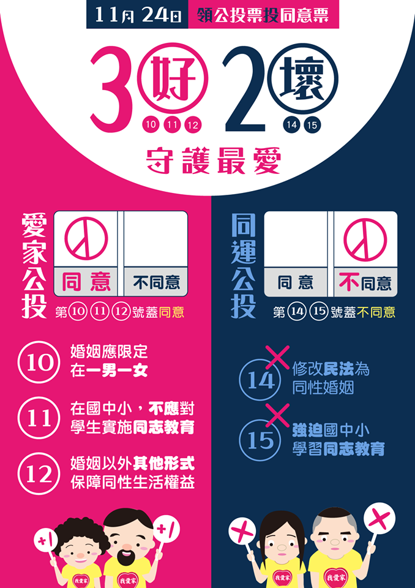

```{r setup, include=FALSE}
knitr::opts_chunk$set(echo = FALSE, warning = FALSE, message = FALSE)
```

## 前言

2018年11月24日中華民國全國性公民投票結果  


## 性平公投 vs. 愛家公投 

<div style="float: left; width: 50%;">
```{r, out.width="100%"}
knitr::include_graphics("figure/性平公投.jpg")
```
</div>

<div style="float: right; width: 50%;">
```{r, out.width="100%"}

```
</div>

## 探討對象

```{r, out.width="60%", fig.align="center"}
knitr::include_graphics("figure/公投第14案.png")
```


## Outline
- 文獻回顧與研究目的
- 資料來源與前處理
- 迴歸模型
- 總結

# 文獻回顧與研究目的


# 資料來源與前處理
## 資料來源
- 公投：
    + [政府資料開放平臺_第14案全國性公民投票計票結果](https://data.gov.tw/dataset/95883)
- 人口年齡組成：
    + [內政資料開放平臺_村里戶數、單一年齡人口（新增區域代碼）](https://bit.ly/30DWL5J)
- 結婚與教育：
    + [內政資料開放平臺_15歲以上現住人口按性別、年齡、婚姻狀況及教育程度分](https://bit.ly/2QdqGgk)
- 薪水中位數：
    + [財政部財政資訊中心_105年度綜合所得稅申報核定統計專冊](https://bit.ly/2M3IiwY)

## 公投第 14 案
```{r}
library(dplyr)
library(tidyr)
data <- readRDS("rawdata.rds")
referendum14 <- data %>% 
  select(1:10) %>% 
  mutate(agree_rate = 同意票數/有效票數)
referendum14$agree_rate <- round(referendum14$agree_rate, digits = 3)
.labels <- cut(referendum14$agree_rate, breaks = seq(0, 0.5, 0.05), include.lowest = TRUE)
.labels <- gsub(",", " ~ ", .labels, fixed=TRUE)
.labels <- gsub("\\(|\\[|\\]", "", .labels)
referendum14$group <- .labels
# 
# library(sp)
# library(RTaiwan)
# library(leaflet)
# library(htmltools)
# library(htmlwidgets)
# library(htmlTable)
# 
# data(TaiwanTownArea, package = "RTaiwan")
# proj4string(TaiwanTownArea)
# TTA <- spTransform(TaiwanTownArea, CRS("+init=epsg:4326"))
# 
# TTA@data <- TTA@data %>% 
#   mutate(site_id = paste0(COUNTY, TOWN))
# TTA@data$site_id[which(TTA@data$site_id == "彰化縣員林鎮")] = "彰化縣員林市"
# TTA@data$site_id[which(TTA@data$site_id == "苗栗縣頭份鎮")] = "苗栗縣頭份市"
# TTA@data <- TTA@data %>% 
#   left_join(referendum14, by = "site_id")
# 
# pal <- colorNumeric(
#   palette = "Spectral",
#   domain = TTA@data$agree_rate)
# 
# TTA.map <- leaflet(TTA) %>%
#   addPolygons(color = "#444444",
#               weight = 1,
#               fillColor = ~ pal(agree_rate),
#               fillOpacity = 0.8,
#               highlightOptions = highlightOptions(color = "white", weight = 2, bringToFront = TRUE),
#               popup = lapply(1:368, function(row){htmlTable(gather(key = "類別", value = "值", TTA@data[row, c("site_id", "agree_rate")]))})) %>%
#   addLegend("bottomleft",
#             title = "公投第14案同意率",
#             pal = pal,
#             values = ~ agree_rate)
#   
# TTA.map
```

## 投票率
```{r}
library(ggplot2)
voteRate <- data %>% 
  select(投票權人數, 投票人數) %>% 
  mutate(vote_rate = 投票人數/投票權人數)

summary(voteRate$vote_rate)

ggplot(voteRate, aes(x = vote_rate)) +
  geom_histogram() +
  theme_bw()
```


## 性別比
```{r}
male_number <- data %>% 
  select_if(grepl("_m", names(.))) %>% 
  apply(1, sum)
female_number <- data %>% 
  select_if(grepl("_f", names(.))) %>% 
  apply(1, sum)
gender_ratio <- male_number / female_number
gender <- data.frame(male_number, female_number, gender_ratio)

summary(gender$gender_ratio)

ggplot(gender, aes(gender_ratio)) +
  geom_histogram() +
  theme_bw()
```


## 年齡組成
老人太多較無法接受 & 都是老人去投票？

```{r}
total_number <- data %>% 
  select(people_age_018_m:people_age_100up_f) %>% 
  apply(1, sum)
order_number <- data %>% 
  select(people_age_065_m:people_age_100up_f) %>% 
  apply(1, sum)
young_number <- data %>% 
  select(people_age_018_m:people_age_030_f) %>% 
  apply(1, sum)
old_ratio <- order_number / total_number
young_ratio <- young_number / total_number
young_old_ratio <- young_ratio / old_ratio
age <- data.frame(old_ratio, young_ratio, young_old_ratio) 
  

summary(age[c("old_ratio", "young_ratio")])

age %>% 
  gather(key = ageGroup, value = ratio, old_ratio, young_ratio) %>% 
  ggplot(aes(x = ratio, fill = ageGroup)) +
  geom_histogram() +
  facet_wrap(~ageGroup) +
  theme_bw()
```

## 年齡組成
年輕人(18~30) / 老年人(65~)
```{r}
summary(age["young_old_ratio"])

ggplot(age, aes(x = young_old_ratio)) +
  geom_histogram() +
  theme_bw()
```


## 結婚狀況
曾今結婚率 = (喪偶＋有偶+離婚)/可結婚
```{r}
married <- data %>% 
  select(site_id, 喪偶:離婚) %>% 
  group_by(site_id) %>% 
  mutate(married_ratio = (喪偶+有偶+離婚) / (喪偶+有偶+未婚+離婚))

summary(married$married_ratio)

ggplot(married, aes(married_ratio)) + 
  geom_histogram() +
  theme_bw()
```

## 教育程度
大專畢業的比例
```{r}
total_edu_number <- data %>% 
  select(博畢:高中畢) %>% 
  apply(1, sum)
college_edu_number <- data %>% 
  select(博畢, 大畢, 專畢, 碩畢) %>% 
  apply(1, sum)
college_ratio <- college_edu_number / total_edu_number
education <- data.frame(total_edu_number, college_edu_number, college_ratio)

summary(education$college_ratio)

ggplot(education, aes(college_ratio)) +
  geom_histogram() +
  theme_bw()
```


## 薪水中位數
```{r}
salaryMed <- data %>%
  select(salary_med)

summary(salaryMed$salary_med)

ggplot(salaryMed, aes(salary_med)) +
  geom_histogram() +
  theme_bw()
```


## scatter-correlation plot
```{r}
# .county <- substring(data$site_id, 1, 3)
# .is_municipality <- .county %in% c("臺北市", "新北市", "桃園市", "臺中市", "臺南市", "高雄市")
# .is_municipality <- factor(.is_municipality, levels = c(TRUE, FALSE), labels = c(1, 0))
# Data <- data.frame(agree_rate = referendum14$agree_rate,
#                    vote_rate = voteRate$vote_rate,
#                    is_municipality = .is_municipality,
#                    gender_ratio = gender$gender_ratio,
#                    young_ratio = age$young_ratio,
#                    old_ratio = age$old_ratio,
#                    young_old_ratio = age$young_old_ratio,
#                    married_ratio = married$married_ratio,
#                    college_ratio = education$college_ratio,
#                    salary_med = salaryMed$salary_med,
#                    row.names = data$site_id)
# 
# saveRDS(Data, "Data.rds")
# write.csv(Data, "Data.csv")

Data <- readRDS("Data.rds") %>% 
  select(agree_rate, vote_rate, is_municipality, 
         gender_ratio, young_old_ratio, 
         married_ratio, college_ratio, salary_med)
.names <- names(Data)
names(Data) <- c("Y", paste0("X", 1:(length(.names)-1)))
for(i in 1:length(.names)){
  attr(Data[[i]], "label") <- .names[i]
}


library(GGally)
# source("ggally_cor.R")
# assignInNamespace("ggally_cor", ggally_cor, "GGally")
# Data %>% 
#   ggpairs() + 
#   theme_bw()
```


# 迴歸模型
## first ordinal regression
agree_rate = ...
```{r}
library(car)
model_1st <- lm(Y ~ ., Data)
summary(model_1st)
```

***
agree_rate = ...
<div class="columns-2">
```{r, size = "Huge"}
Anova(model_1st,type = "II")
```
  
```{r}
anova(model_1st)
```
</div>

## residul plot
```{r}
model_1st_data <- data.frame(res = residuals(model_1st),
                             fit = predict(model_1st),
                             y = Data$Y)
g1 <- ggplot(model_1st_data, aes(x = res, y = fit)) +
  geom_point() +
  theme_bw()

g2 <- ggplot(model_1st_data, aes(sample = res)) +
  geom_qq() +
  geom_qq_line(color = "red", line.p = c(0.25, 0.75), linetype = "dashed") + 
  theme_bw()

gridExtra::grid.arrange(g1, g2, nrow = 1)
```

## 移除 outlier
```{r}
Data.rm <- Data[-4,]
model_1st.rm <- lm(Y ~ ., Data.rm)
summary(model_1st.rm)
```

## find better models
```{r, comment=NA}
library(leaps)
best <- function(model, nbest = 1, nvmax = 8, ...) {
  subsets <- regsubsets(formula(model), model.frame(model), nbest = nbest, nvmax = nvmax, ...)
  subsets <- with(summary(subsets),
                  cbind(p = as.numeric(rownames(which)), which, rss,
                        rsq, adjr2, cp, bic))
    
  return(subsets)
}  

. <- round(best(lm(Y ~. + .:., Data.rm), nbest = 2, nvmax = 10), 4)
knitr::kable(., format = 'html')
```

## find
```{r}
DT::datatable(., rownames = FALSE)
```

#
## 總結
